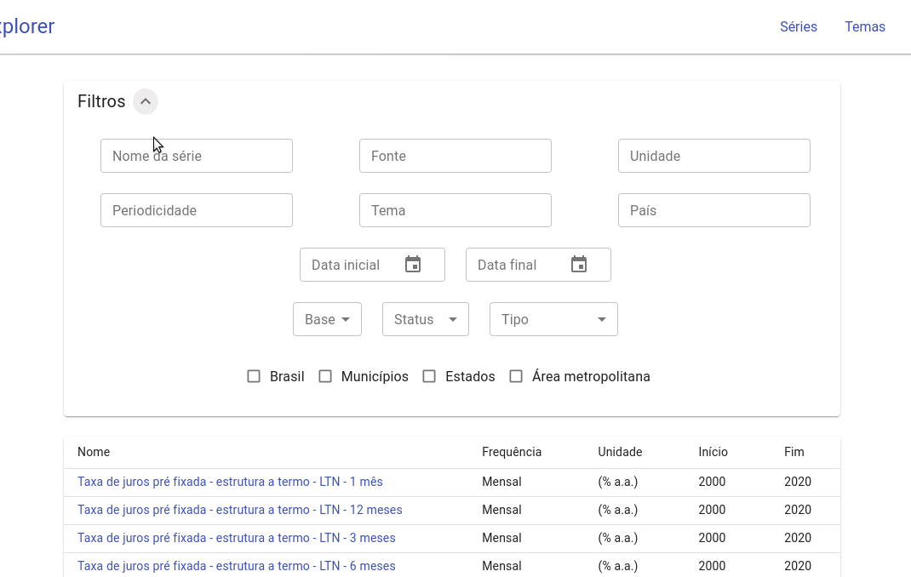

# [Ipeadata Explorer](http://ipeadata-explorer.surge.sh/)

Este é um front-end para o Ipeadata, a base de dados do mantida pelo Ipea que
reúne séries temporais de diversas fontes, temas e países.

O site tem como objetivo ajudar pesquisadores, estudantes e a quem mais
interesse, a descobrir e visualizar as séries disponíveis.

Tive como inspiração a versão 3 (beta) do [site oficial do Ipeadata](http://ipeadata.gov.br/beta3/).

Tecnologias utilizadas:

- [React](react).
- [Material-UI](material-ui).
- OData (Open Data Protocol) para interagir com o backend do Ipeadata (queries
  para [filtrar](odata-url-conventions) e [agregar](odata-aggregation) os dados
  etc.).
- [Chart.js](chartjs) para visualizações de dados simples (.
- [chartjs-chart-geo](chartjs-chart-geo), plugin do Chart.js para plotar dados
  distribuídos geograficamente, como um mapa choropleth, utilizado topoJSON,
  por exemplo.
- APIs de [malhas](ibge-malhas) e de [localidades](ibge-localidades) para obter
  o TopoJSON de regiões geográficas do Brasil e listas de todas as regiões,
  respectivamente.

# Demo

[material-ui]: material-ui.com/
[ipea-api]: http://ipeadata.gov.br/api/
[react]: https://reactjs.org/docs/getting-started.html
[odata-url-conventions]: https://docs.oasis-open.org/odata/odata/v4.01/odata-v4.01-part2-url-conventions.html
[odata-aggregation]: http://docs.oasis-open.org/odata/odata-data-aggregation-ext/v4.0/cs01/odata-data-aggregation-ext-v4.0-cs01.html#_Toc378326289
[chartjs]: https://www.chartjs.org/docs/latest/
[chartjs-chart-geo]: https://github.com/sgratzl/chartjs-chart-geo
[ibge-malhas]: https://servicodados.ibge.gov.br/api/docs/malhas?versao=2
[ibge-localidades]: https://servicodados.ibge.gov.br/api/docs/localidades?versao=1
